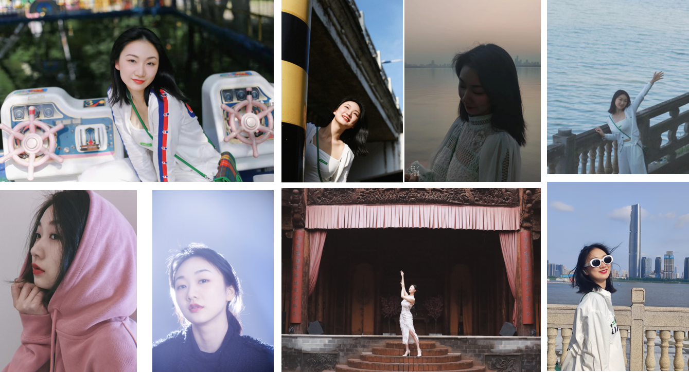



Education
======
* B.S. in School of Mechanical Science & Engineering, Huazhong University of Science and Technology, 2016-2020
* Ph.D candidate in School of Mechanical Science & Engineering, Huazhong University of Science and Technology, 2020-2025
  (expected)

Work experience
======
* 07/2018-08/2018: Algorithm Engineer
  * [LDROBOT](https://www.ldrobot.com/about-us)
  * Duties included: Semantic segmentation for 2D plane map

  
  
Skills
======
* Deep learning
* Anomaly Detection

Publications
======
  <ul>
    
  </ul>
  
Photos
======
Ruoyu Wang is my lovely girlfriend.

